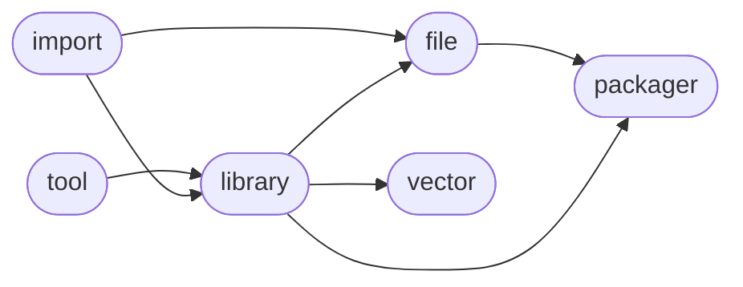

<h1>genlibrary</h1>

Missing description.

<h2>Table of Contents</h2>

<pre>
<a href='#genlibrary'>genlibrary</a>
├─ <a href='#Dependency-Diagram-for-ManderaGeneral'>Dependency Diagram for ManderaGeneral</a>
├─ <a href='#Installation-showing-dependencies'>Installation showing dependencies</a>
├─ <a href='#Information'>Information</a>
├─ <a href='#Attributes'>Attributes</a>
└─ <a href='#Contributions'>Contributions</a>
</pre>

<h2>Dependency Diagram for ManderaGeneral</h2>

<h2>Installation showing dependencies</h2>

| `pip install`                                                        | `genlibrary`   |
|:---------------------------------------------------------------------|:---------------|
| <a href='https://pypi.org/project/generallibrary'>generallibrary</a> | ✔️             |

<h2>Information</h2>

| Package                                                    | Ver                                           | Latest Release       | Python                                                                                                                                                                                                                                                 | Platform        | Cover   |
|:-----------------------------------------------------------|:----------------------------------------------|:---------------------|:-------------------------------------------------------------------------------------------------------------------------------------------------------------------------------------------------------------------------------------------------------|:----------------|:--------|
| [genlibrary](https://github.com/ManderaGeneral/genlibrary) | [0.0.1](https://pypi.org/project/genlibrary/) | 2023-02-10 12:13 CET | [3.8](https://www.python.org/downloads/release/python-380/), [3.9](https://www.python.org/downloads/release/python-390/), [3.10](https://www.python.org/downloads/release/python-3100/), [3.11](https://www.python.org/downloads/release/python-3110/) | Windows, Ubuntu | ❌       |

<h2>Attributes</h2>

<pre>
<a href='https://github.com/ManderaGeneral/genlibrary/blob/master/genlibrary/__init__.py#L1'>Module: genlibrary</a>
</pre>

<h2>Contributions</h2>

Issue-creation and discussions are most welcome!

Pull requests are currently not wanted, please discuss with me before investing any time

Generated 2023-02-10 12:13 CET for commit <a href='https://github.com/ManderaGeneral/genlibrary/commit/master'>master</a>.

